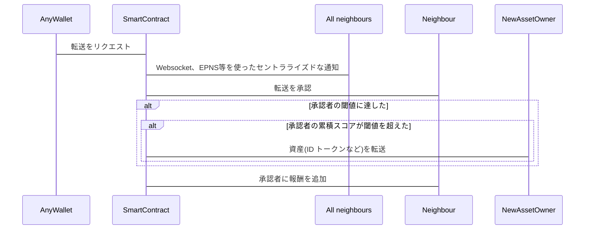

---
eip: 5883
title: トークン転送による社会的回復
description: ユーザーの評判を考慮し、最近接ネイバーアプローチを使用したオンチェーンの社会的回復。
author: Erhard Dinhobl (@mrqc), Kevin Riedl (@wsdt)
discussions-to: https://ethereum-magicians.org/t/eip-5806-delegate-transaction/11409
status: 停滞
type: Standards Track
category: ERC
created: 2022-07-19
---

## 概要

このEIPは、アクセスできないアカウントからの新しいアカウントへのトークン転送を可能にする社会的回復のメカニズムを標準化します。この承認は純粋に技術的なものではなく、人的介入が必要です。これらの人間は - Soul Bound Token提案に基づいて - Soulsと呼ばれます。十分な数のSoulsが承認(Yes/No決定)を行い、しきい値に達すると、トークンが古いアイデンティティから新しいアイデンティティに転送されます。

## 動機

アカウントの秘密鍵が失われるという問題は周知のとおりです。その鍵が失われると、そのアカウントが所有するトークンを回復することはできません。所有者はそれらのトークンを永遠に失います。トークン所有者への直接的な被害に加えて、そのトークン自体のエコシステム全体にも影響が及びます。失われたトークンが多ければ多いほど、そのエコシステムの自然な成長と計画された進化に利用可能なトークンが少なくなります。

## 仕様

```solidity
pragma solidity ^0.8.7;

interface ISocialRecovery {
    /// @dev 関連しているが独立したアイデンティティが転送を承認する
    function approveTransfer(address from_, address to_) external;

    /// @dev ユーザーがオンチェーンのアイデンティティを別のウォレットに移動したい場合、n-nearest neighbour アイデンティティの承認が必要
    function requestTransfer(address from_, address to_) external payable;

    function addNeighbour(address neighbour_) external;

    function removeNeighbour(address neighbour_) external;
}
```

**その背景にある数学**:

準拠したコントラクトは、次の式を使用してノードnのスコアを計算する必要があります:

$ score(n) = tanh({ { {\displaystyle\sum_{i = 1}^{|N|} } {log{(n_i^{r} {1 \over t - n_i^{t} + 1})}} \over{|N| + 1}} + n^{r}}) $

ここで:

$t$ は現在の時間(block.timestamp、block.numberなどの時間を特定する任意の値)
$n^{r}$ はノードnの報酬カウント
$N$ はnの隣接ノードのリスト
$n_i^{r}$ はnからの隣接ノードiの報酬カウント
$n_i^{t}$ はnからの隣接ノードiの最後のタイムスタンプ(報酬が付与された時)

**フロー**:



## 根拠

提案された式は非常に強靭であり、オンチェーンのスコアに実際の価値を見出すための一貫した動機付け構造を提供します。この式は時間に基づいたスコアに基づいて重みを追加し、指標の公平性をさらに高めています。

## セキュリティ上の考慮事項

1) ユーザーが多くの報酬を得るのを防ぐメカニズムがないことが現時点での懸念です。確かに、高い報酬は多額の投資に結びついていますが、その報酬額を得たいと考え、十分な資金を持っている人物が到達することができます。改善点としては、アドレスに結び付けられたユーザーを本当に特定する仕組みを見つけることです。ファジーな(確実に!)実世界のオブジェクトをハッシュ化し、ファジーなセットに基づいて同じハッシュを生成するというメカニズムを考えています。

2) 社会的トークン転送を可能にするために達成しなければならない閾値を実装しました。現時点では「良い」または「悪い」閾値を定義する経験がないため、初期値を見つけようとしました。これは、今後の経験に基づいて調整される可能性があります。

3) 別の問題は、必要な最小限の承認を得るためにネイバーネットワークがもはや活発ではないということです。つまり、承認の最小数に達できないため、ユーザーは社会的トークン転送を実行することができなくなります。したがって、このコントラクトの存続は使用状況に依存しており、使用されなくなると役立たなくなる可能性があります。

## 著作権

著作権およびその関連権利は[CC0](../LICENSE.md)により放棄されています。