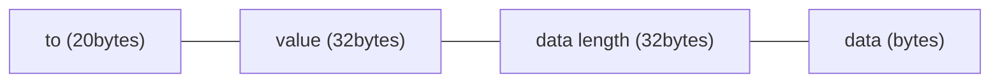

---
eip: 7638
title: SCA におけるバッチコールのエンコーディング
description: スマートコントラクトアカウント (SCA) の複数のコールをアトミックに、ガスを節約してエンコーディングする
author: George (@JXRow), Zisu (@lazy1523)
discussions-to: https://ethereum-magicians.org/t/erc-7638-optimized-calls-encoding/18966
status: Draft
type: Standards Track
category: ERC
created: 2024-02-26
---

## 概要
バッチコールエンコーディング (Batch Calls Encoding、BCE) は、スマートコントラクトアカウント (SCA) ウォレットが複数のコールを単一のコールにまとめ、パラメータをバイトにエンコーディングし、オンチェーンデータを圧縮してガスを節約する解決策を示します。アトミック操作と非アトミック操作の両方に使用できます。

## 動機
通常、ユーザーとコントラクト間の相互作用は、`approve`-`transferFrom` のような一連の整合性のある操作で構成されます。EOA ウォレットでは、ユーザーが各操作を順次確認する必要がありますが、SCA ウォレットでは、すべての操作を単一の確認で完了させ、アトミシティを実現できます。`approve` が成功し `transferFrom` が失敗した場合、セキュリティリスクが生じます。安全なアプローチは、1 つの操作が失敗した場合、関連するすべての操作も失敗するようにすることで、アトミシティを確保することです。そのため、この暗号化方式を提案し、複数のパラメータをバイトにエンコーディングし、オンチェーンデータを圧縮し、ガスを節約します。アトミック操作と非アトミック操作の両方に使用できます。

上記の `approve`-`transferFrom` のアトミック操作に加えて、ガス代の支払い委任も実現できます。これには、ユーザーとバンドラーが一連のコールに署名し、コールの内容に以下が含まれます:

1. ユーザーが SCA を通じて複数のコールを開始したい。
2. ユーザーがバンドラーに手数料として 10 USDT を送金する。
3. バンドラーがコールを送信し、ETH ガスを支払い、10 USDT を受け取る。

ユーザーはコールの内容をエンコーディングし、署名を付けて整合性を確保し、バンドラーに送信します。バンドラーがガス代が不十分と判断した場合、送信しないことができます。ただし、コールの内容を承認した場合、署名されたトランザクションを送信できます。実行後、ユーザーは目的の操作を得、バンドラーは手数料を受け取ります。

[EIP-4337](./eip-4337.md) もガス代の支払い委任を実装しています。BCE と [EIP-4337](./eip-4337.md) は相互に排他的ではなく、SCA 内で並行して実装できます。

実証テストに基づくと、BCE は代替手段よりも単純でガス効率が高いです。

## 仕様
この文書の「MUST」、「MUST NOT」、「REQUIRED」、「SHALL」、「SHALL NOT」、「SHOULD」、「SHOULD NOT」、「RECOMMENDED」、「NOT RECOMMENDED」、「MAY」、「OPTIONAL」というキーワードは、RFC 2119 およびRFC 8174 に記載されているように解釈されるものとします。

この ERC では、SCA がコントラクトに実装されることが **REQUIRED** です。Dapp はユーザーの意図をウォレット拡張機能に伝え、ウォレットはバッチコールエンコーディングを使用してバイトで複数のコールをユーザーの SCA コントラクトに送信します。

_バッチコール_ は、以下のようにエンコーディングされた複数の `Call` バイトで構成されます:



ここで:
- `to`: 呼び出されるコントラクトのアドレス。Solidity の address 型に対応し、20 バイトです。
- `value`: コントラクトに送信される ETH (wei 単位) の量。Solidity の uint 型に対応し、32 バイトです。
- `data length`: データ (バイト単位) の長さ。Solidity の uint 型に対応し、32 バイトです。
- `data`: コントラクトに送信される関数データのエンコーディング。Solidity の bytes 型に対応し、`data length` で定義された長さです。

複数の `Call` ユニットを連結して _バッチコール_ シーケンスを形成します。

## 根拠
各コールには 3 つのパラメータ (`to`\`value`\`data`) がカプセル化されています。従来のアプローチでは、これらのパラメータをstructにパッケージ化し、複数のstructを配列に配置していました。ただし、structを使用するとオーバーヘッドが発生し、`to`\`value`\`data`の型もエンコーディングされるため、エンコーディングのサイズが大きくなります。`to`\`value`\`data`の型が固定されているため、この追加のエンコーディングは省略できます。Solidityでは、`bytes calldata`からスライスを使ってデータを読み取るのがガス効率的です。これらの要因を考慮すると、_バッチコールエンコーディング_はオンチェーンデータを圧縮し、ガスを節約できます。

## 下位互換性
このERCはコンセンサスレイヤーを変更しないため、Ethereumの全体としての下位互換性の問題はありません。

このERCは他のERC標準を変更しないため、Ethereumアプリケーションの下位互換性の問題もありません。

## 参考実装
この提案では_バッチコール_のエンコーディングのみを指定し、具体的な実装と命名はプロジェクトの裁量に委ねています。以下は、ユーザーが複数の操作に署名し、バンドラーがユーザーに代わってガスを支払うことができる SCA コントラクトの例です (「atomCallbytes」と呼ばれています):

### `SmartWallet.sol`

```solidity
pragma solidity ^0.8.0;

import "@openzeppelin/contracts/utils/cryptography/ECDSA.sol";

contract SmartWallet {
    using ECDSA for bytes32;

    uint32 public valid = 1; //to make AtomSign invalid

    address private immutable original;
    address public owner;
    address public bundler;

    mapping(bytes32 => bool) public usedMsgHashes;

    modifier onlyBundler() {
        require(
            bundler == msg.sender,
            "onlyBundler: caller is not the bundler"
        );
        _;
    }

    modifier onlyOwnerAndOriginal() {
        require(
            owner == msg.sender || original == msg.sender,
            "onlyOwnerAndOriginal: caller is not the owner"
        );
        _;
    }

    constructor(address _bundler) {
        original = address(this);
        owner = msg.sender;
        bundler = _bundler;
    }

    function atomSignCall(
        bytes calldata atomCallbytes,
        uint32 deadline,
        bytes calldata signature
    ) external onlyBundler {
        require(deadline >= block.timestamp, "atomSignCall: Expired");
        bytes32 msgHash = keccak256(
            bytes.concat(
                msg.data[:msg.data.length - signature.length - 32],
                bytes32(block.chainid),
                bytes20(address(this)),
                bytes4(valid)
            )
        );
        require(!usedMsgHashes[msgHash], "atomSignCall: Used msgHash");
        require(
            owner == msgHash.toEthSignedMessageHash().recover(signature),
            "atomSignCall: Invalid Signature"
        );

        //do calls
        uint i;
        while(i < atomCallbytes.length) {
            address to = address(uint160(bytes20(atomCallbytes[i:i+20])));
            uint value = uint(bytes32(atomCallbytes[i+20:i+52]));
            uint len = uint(bytes32(atomCallbytes[i+52:i+84]));

            (bool success, bytes memory result) = to.call{value: value}(atomCallbytes[i+84:i+84+len]);
            if (!success) {
                assembly {
                    revert(add(result, 32), mload(result))
                }
            }

            i += 84 + len;
        }

        usedMsgHashes[msgHash] = true;
    }

    /**
     * if you signed something then regretted, make it invalid
     */
    function makeAtomSignInvalid() public onlyOwnerAndOriginal {
        valid = uint32(uint(blockhash(block.number)));
    }
}
```

### `Bundler.sol`

```solidity
pragma solidity ^0.8.0;

contract Bundler {

    address public owner;

    modifier onlyOwner() {
        require(
            owner == msg.sender,
            "onlyOwner: caller is not the owner"
        );
        _;
    }

    constructor() {
        owner = msg.sender;
    }

    function executeOperation(
        address wallet,
        bytes calldata data
    ) public onlyOwner {
        (bool success, bytes memory result) = _callTo.call{value: 0}(data);

        if (!success) {
            assembly {
                revert(add(result, 32), mload(result))
            }
        }
    }
}
```

## セキュリティ上の考慮事項
この提案は、データ圧縮を目的としたデータエンコーディングスキームを導入します。データ圧縮のみを扱い、データの損失や非公開データの隠蔽につながるものではありません。

## 著作権
著作権およびそれに関連する権利は [CC0](../LICENSE.md) により放棄されています。